# ICTOB Prep Lab — আইসিটি প্রস্তুতি ল্যাব

**A free, offline-first, Bangla + English practice lab for ICT Olympiad Bangladesh.**
Segment-wise MCQ practice with explanations, timed mock tests in the official format, a weak-spot tracker, and four interactive labs (number systems, logic gates, sorting & binary search visualiser, cipher & password lab) that make ICT concepts something you *see*, not memorise.

🔗 **Live demo:** https://ictob-prep-lab.vercel.app  ·  👤 Built by [Mahir Faysal](https://mfaysal.com) ([@mfaysal-dev](https://github.com/mfaysal-dev))

<p>
  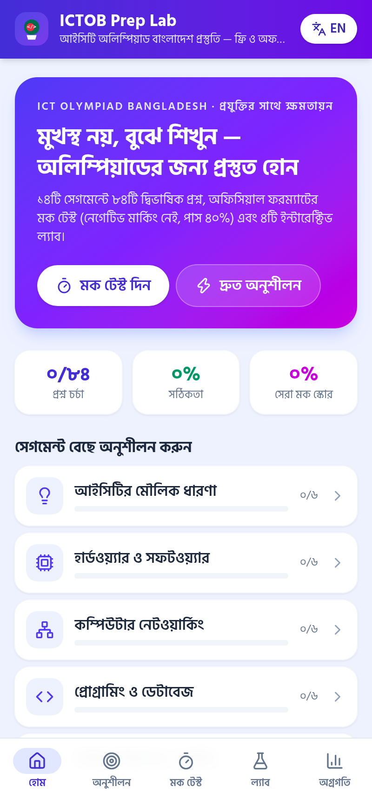
  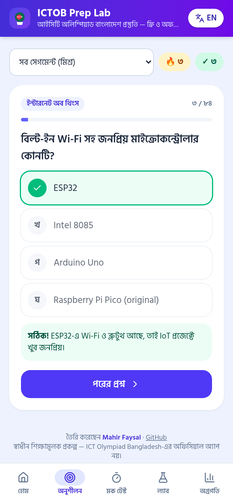
  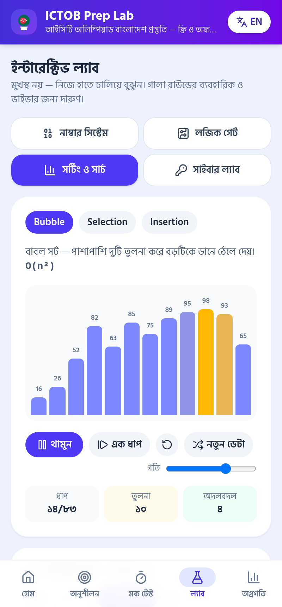
  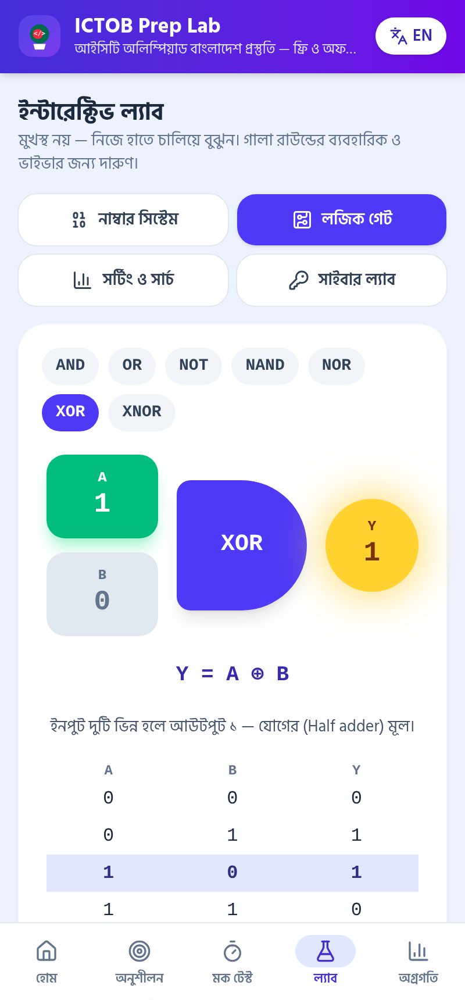
</p>

## The problem

Thousands of school, college and madrasa students across Bangladesh sit ICT Olympiad rounds every year, but:

- Good practice material is scattered, mostly English-only, and often needs constant mobile data.
- ICT is taught as memorisation ("NAND is a universal gate") — students rarely *see* a binary conversion, a logic gate or a sorting algorithm actually work.
- Students outside Dhaka often have no coaching and no way to know which topics they are weak in.

## The solution

ICTOB Prep Lab is a **Progressive Web App** that works fully offline after the first visit, in Bangla first with a one-tap English switch.

| Feature | Details |
|---|---|
| 📚 **84 bilingual MCQs** | Across all **14 Season 3 segments** — Basic ICT, Hardware & Software, Networking, Programming & Database, Cybersecurity & Cloud, E-Commerce, Green Digitalization, IoT, AI & ChatGPT, Robotics & ML, VR/AR, Quantum Computing, Tech Entrepreneurship & Social Business, Freelancing |
| 💡 **Instant explanations** | Every answer has a short explanation with a Bangladesh example where possible (bKash, D-Nothi, solar home systems, submarine cables…) |
| ⏱️ **Mock test** | 10 / 20 / 30 questions, 45 s per question, balanced across segments, **no negative marking and 40% pass mark — matching the official FAQ** for the selection round, with per-segment results and full answer review |
| 🎯 **Weak-spot tracker** | Per-segment accuracy, your 3 weakest segments, a "retry my mistakes" mode, and mock-test history |
| 🔢 **Number system lab** | Binary / octal / decimal / hex converter with step-by-step division and place-value working |
| 🔌 **Logic gate lab** | AND, OR, NOT, NAND, NOR, XOR, XNOR with toggle inputs, glowing output, Boolean expression and live truth table |
| 📊 **Sorting & search lab** | Bubble / selection / insertion sort animation with step, speed, comparison and swap counters, plus a step-by-step **binary search** that proves O(log n) |
| 🔐 **Cyber lab** | Caesar cipher with shift wheel, and a password strength meter that calculates entropy and time-to-crack — entirely on-device |
| 📴 **Offline & private** | Service-worker cached, no login, no server, no analytics; progress is stored only in the browser's `localStorage` |

**No API keys, no paid services, no backend.** Pure static files.

## How it fits ICT Olympiad Bangladesh

- **Built for the format.** According to the official FAQ, the selection, quarter-final and semi-final rounds are **MCQ, auto-graded, with no negative marking and a 40% pass mark for the selection round**; the gala round adds written work, **practical work, viva and presentation** in front of an ICT jury. The mock test copies the MCQ format, and the labs are designed for practical and viva preparation.
- **Covers the syllabus.** Questions follow the 14 segments listed for Season 3 on ictolympiadbangladesh.com.
- **Matches the theme "প্রযুক্তির সাথে ক্ষমতায়ন" (Empowerment with Technology).** A student in Kurigram or Bhola with a low-cost phone and no data gets the same prep as a student in Dhaka.
- **Shows real CS skills.** Algorithm visualisation, Boolean logic, number-base conversion, entropy maths, PWA caching and i18n give plenty to talk about in a viva.

## Tech stack

- **React 19 + TypeScript + Vite**
- **Tailwind CSS v4**
- **vite-plugin-pwa (Workbox)** for offline precaching and installability
- **@fontsource/hind-siliguri**, a self-hosted Bangla font that works offline
- **lucide-react** icons
- Deployed on **Vercel** as a static site

## Run locally

```bash
npm install
npm run dev      # http://localhost:5173
npm run build    # production build + service worker in dist/
npm run preview  # test the offline build
```

## Add your own questions

All questions live in [`src/data/questions.ts`](src/data/questions.ts). Each one is a single line:

```ts
q('net', 'IPv4 ঠিকানা কত বিটের?', 'How many bits is an IPv4 address?',
  ['32', '64', '128', '16'], 0,
  'IPv4 = 32 বিট, IPv6 = 128 বিট।', 'IPv4 = 32 bits; IPv6 = 128 bits.'),
```

Options are shuffled at runtime, so the answer index can stay `0`. Teachers and clubs can fork the project and add their own question banks.

## Project structure

```
src/
  App.tsx              # Home, Practice, Mock test, Progress
  Labs.tsx             # Number system, Logic gate, Sorting/Binary search, Cyber labs
  lib.ts               # Bangla numerals, localStorage hook, shuffle
  data/questions.ts    # 14 segments × 6 bilingual questions with explanations
```

## Screenshots

| Mock setup | Mock running | Mock result | Number lab | Binary search | Cyber lab | Progress |
|---|---|---|---|---|---|---|
| 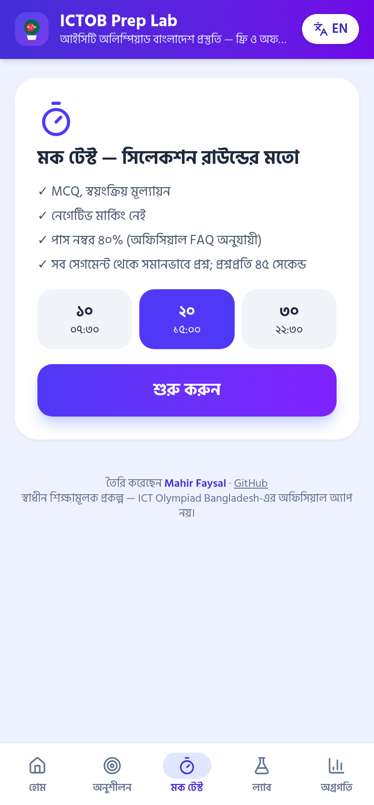 | 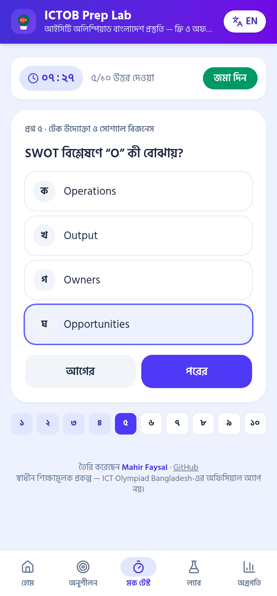 | 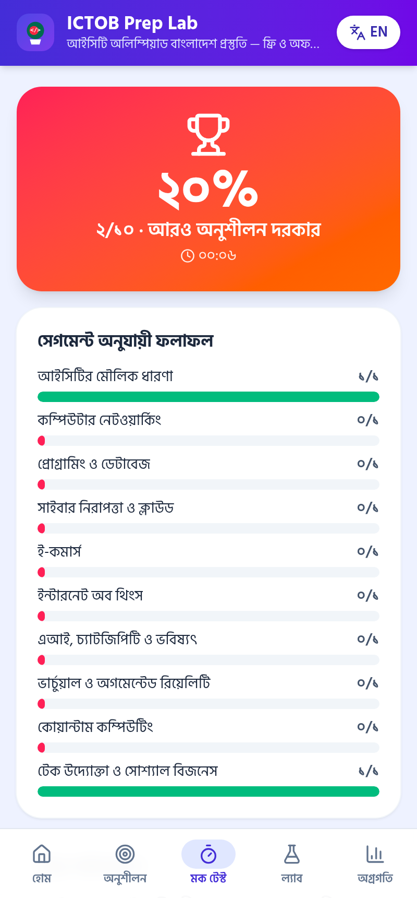 | 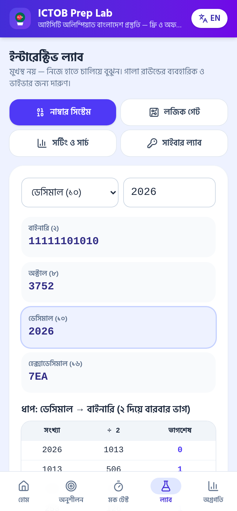 | 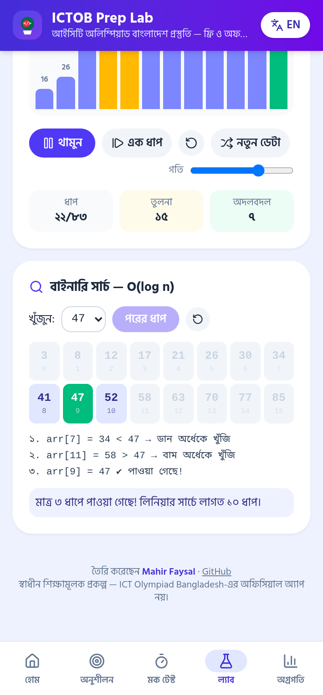 | 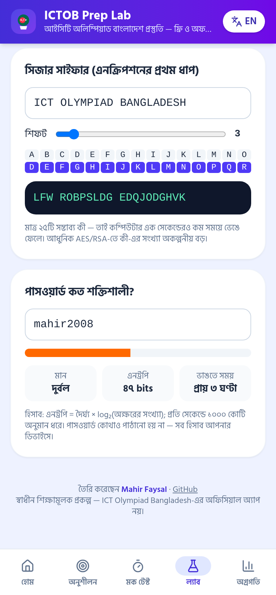 | 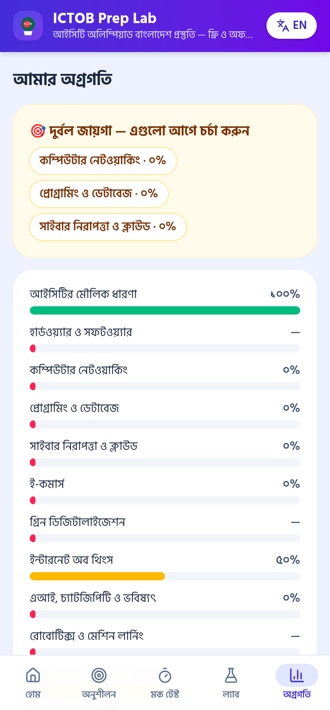 |

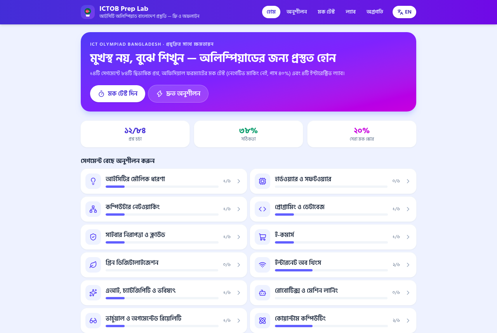

## Disclaimer

This is an independent educational project and **is not affiliated with or endorsed by ICT Olympiad Bangladesh**. Questions are original practice material written for learning, not leaked or official questions.

## License

MIT © Mahir Faysal
